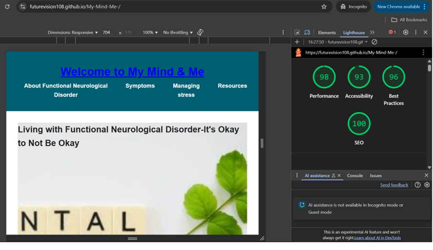

# My-Mind-Me-
## About 
A beginner friendly, accessible website designed  to provide understanding of Functional Neurological Disorder(FND) and the resources included for additional help .

# Purpose

Mental Health Matters aims to:
- Educate users about mental health in a non-clinical, approachable way
- Provide stress management tips and positive affirmations
- Offer quick access to trusted mental health resources
- Promote awareness and emotional well-being for all users

---

# User Value 

- Easy-to-navigate one-page layout
- Responsive design for mobile and desktop
- WCAG-compliant accessibility features
- No login required — immediate access to support

# Tools
- HTMl used for main content
- CSS used for styling
- Git used for version control
- w3c HTMl and CSS validator used 
-ligthouse 

#
Lighthouse test:

# Git command used:
- git switch newbranch
- git add.
- git commit -m"
- git switch main
- git merge newbranch
- git push
- git  status

# The use of AI:
-  co pilot on VS code was used for trouble hooting the issues.
- Co pilot was also use to take th content about the Functional Nurological Disorder

# Deployment
The repository was cloned on vs code and all the work wor was completed on new brancheand then finally merged into main branch and after testing the  commits were pushed into git hub

https://github.com/Futurevision108/My-Mind-Me-

# Credit:
-Unsplash ( used for images)
-University Hospitals Plymouth NHS Trust( Info about FND and  resources links used)

![alt text])